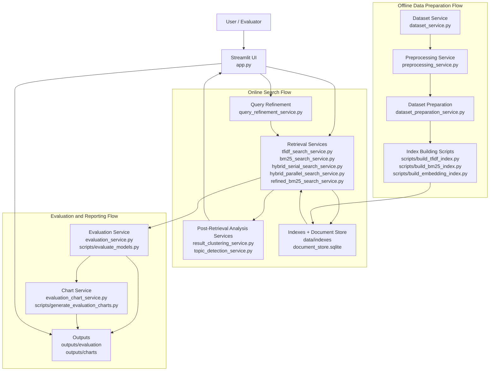

```mermaid
flowchart TD

    USER["User / Evaluator"]
    UI["Streamlit UI<br/>app.py"]

    USER --> UI

    subgraph ONLINE["Online Search Flow"]
        QR["Query Refinement<br/>query_refinement_service.py"]
        RET["Retrieval Services<br/>tfidf_search_service.py<br/>bm25_search_service.py<br/>hybrid_serial_search_service.py<br/>hybrid_parallel_search_service.py<br/>refined_bm25_search_service.py"]
        ANALYSIS["Post-Retrieval Analysis Services<br/>result_clustering_service.py<br/>topic_detection_service.py"]
        STORE["Indexes + Document Store<br/>data/indexes<br/>document_store.sqlite"]
    end

    subgraph OFFLINE["Offline Data Preparation Flow"]
        DS["Dataset Service<br/>dataset_service.py"]
        PREP["Preprocessing Service<br/>preprocessing_service.py"]
        DPREP["Dataset Preparation<br/>dataset_preparation_service.py"]
        BUILD["Index Building Scripts<br/>scripts/build_tfidf_index.py<br/>scripts/build_bm25_index.py<br/>scripts/build_embedding_index.py"]
    end

    subgraph EVALUATION["Evaluation and Reporting Flow"]
        EV["Evaluation Service<br/>evaluation_service.py<br/>scripts/evaluate_models.py"]
        CH["Chart Service<br/>evaluation_chart_service.py<br/>scripts/generate_evaluation_charts.py"]
        OUT["Outputs<br/>outputs/evaluation<br/>outputs/charts"]
    end

    UI --> QR
    UI --> RET
    QR --> RET

    RET --> STORE
    STORE --> RET

    RET --> ANALYSIS
    ANALYSIS --> UI

    DS --> PREP
    PREP --> DPREP
    DPREP --> BUILD
    BUILD --> STORE

    RET --> EV
    EV --> CH
    EV --> OUT
    CH --> OUT

    UI --> OUT
```
