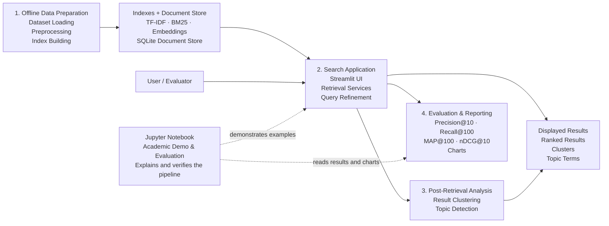

```mermaid
flowchart LR

    USER["User / Evaluator"]

    PREP["1. Offline Data Preparation<br/>Dataset Loading<br/>Preprocessing<br/>Index Building"]

    STORE["Indexes + Document Store<br/>TF-IDF · BM25 · Embeddings<br/>SQLite Document Store"]

    SEARCH["2. Search Application<br/>Streamlit UI<br/>Retrieval Services<br/>Query Refinement"]

    ANALYSIS["3. Post-Retrieval Analysis<br/>Result Clustering<br/>Topic Detection"]

    RESULTS["Displayed Results<br/>Ranked Results<br/>Clusters<br/>Topic Terms"]

    EVAL["4. Evaluation & Reporting<br/>Precision@10 · Recall@100<br/>MAP@100 · nDCG@10<br/>Charts"]

    NOTEBOOK["Jupyter Notebook<br/>Academic Demo & Evaluation<br/>Explains and verifies the pipeline"]

    PREP --> STORE
    STORE --> SEARCH
    USER --> SEARCH
    SEARCH --> RESULTS
    SEARCH --> ANALYSIS
    ANALYSIS --> RESULTS

    SEARCH --> EVAL

    NOTEBOOK -. reads results and charts .-> EVAL
    NOTEBOOK -. demonstrates examples .-> SEARCH
```
