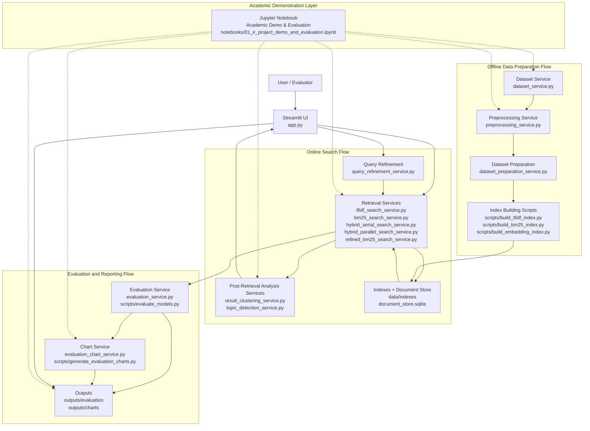

The dashed lines above show that the **Jupyter Notebook is not part of the Online Search Flow**. It does not sit between the user and the retrieval services, and it does not change ranking or evaluation results.

**Streamlit (`app.py`)** is the actual user-facing interface for searching, refining queries, and browsing results interactively.

The **Notebook** (`notebooks/01_ir_project_demo_and_evaluation.ipynb`) is a separate academic demonstration layer. It calls the same Dataset Service, Preprocessing Service, and Retrieval Services, and reads the same Evaluation Outputs and Charts, plus the Post-Retrieval Analysis Services (Result Clustering and Topic Detection), purely to document, verify, and re-present the project's pipeline and results for course evaluation — it does not serve end users and does not replace the Streamlit UI.

> **Note:** `report/screenshots/13_architecture_diagram.png` still reflects the diagram *before* this Academic Demonstration Layer was added. No tool to render the updated Mermaid diagram into a PNG was available in this environment, so the screenshot should be regenerated manually (e.g. by re-exporting this diagram from a Mermaid-compatible viewer) and replaced later.
