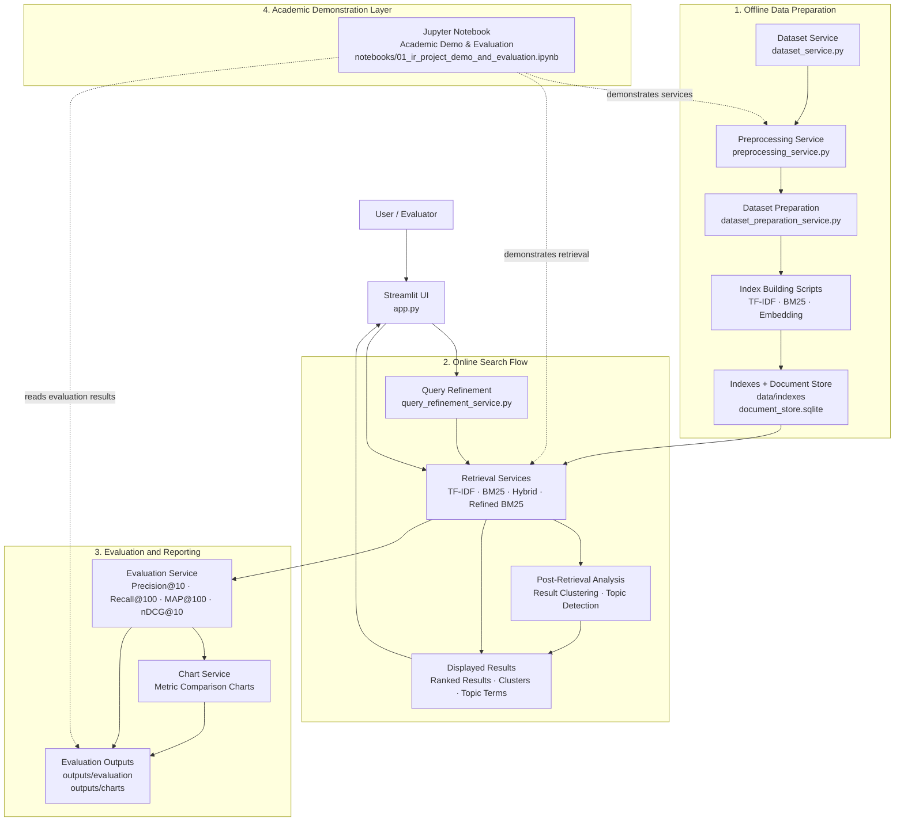

```mermaid
flowchart TD

    USER["User / Evaluator"]
    UI["Streamlit UI<br/>app.py"]

    subgraph OFFLINE["1. Offline Data Preparation"]
        DS["Dataset Service<br/>dataset_service.py"]
        PRE["Preprocessing Service<br/>preprocessing_service.py"]
        DPREP["Dataset Preparation<br/>dataset_preparation_service.py"]
        BUILD["Index Building Scripts<br/>TF-IDF · BM25 · Embedding"]
        STORE["Indexes + Document Store<br/>data/indexes<br/>document_store.sqlite"]

        DS --> PRE
        PRE --> DPREP
        DPREP --> BUILD
        BUILD --> STORE
    end

    subgraph ONLINE["2. Online Search Flow"]
        QR["Query Refinement<br/>query_refinement_service.py"]
        RET["Retrieval Services<br/>TF-IDF · BM25 · Hybrid · Refined BM25"]
        ANALYSIS["Post-Retrieval Analysis<br/>Result Clustering · Topic Detection"]
        RESULTS["Displayed Results<br/>Ranked Results · Clusters · Topic Terms"]

        QR --> RET
        RET --> ANALYSIS
        RET --> RESULTS
        ANALYSIS --> RESULTS
    end

    subgraph EVAL["3. Evaluation and Reporting"]
        EV["Evaluation Service<br/>Precision@10 · Recall@100 · MAP@100 · nDCG@10"]
        CHARTS["Chart Service<br/>Metric Comparison Charts"]
        OUT["Evaluation Outputs<br/>outputs/evaluation<br/>outputs/charts"]

        EV --> CHARTS
        EV --> OUT
        CHARTS --> OUT
    end

    subgraph ACADEMIC["4. Academic Demonstration Layer"]
        NB["Jupyter Notebook<br/>Academic Demo & Evaluation<br/>notebooks/01_ir_project_demo_and_evaluation.ipynb"]
    end

    USER --> UI
    UI --> QR
    UI --> RET
    STORE --> RET
    RESULTS --> UI

    RET --> EV

    NB -. "demonstrates services" .-> PRE
    NB -. "demonstrates retrieval" .-> RET
    NB -. "reads evaluation results" .-> OUT
```
